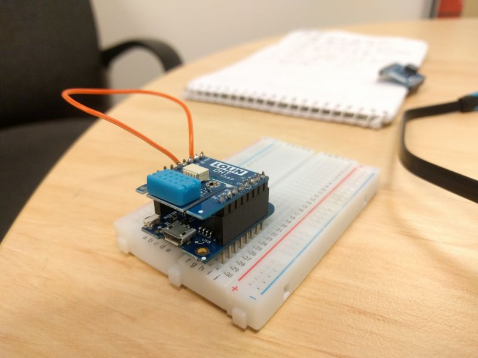

# micropython_dht
this is a very short tutorial to get you up and running with a dht12 sensor shield

The main.py script uses the DHT library written by [mike](https://github.com/mcauser/micropython-dht12) but there are many others.
The DHT12 shield used has the option of using i2c communication (as used in main.py) or one-wire

to use one wire you need to pull the fouth wire on the DHT sensor to ground.  
the only reason I can think of for using one-wire over i2c for this application is if you are heavily constrained on available GPIOs

